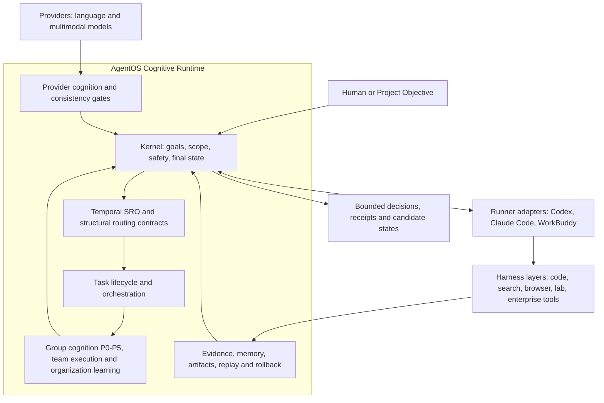

# AgentOS

**Harness 与 Runner 的认知运行时操作系统**<br>
**A cognitive runtime operating system for Harnesses and Runners**

当前版本 / Current version: **AgentOS CoreSlim 0.4.0-alpha.21**

[中文](#中文) | [English](#english) | [Apache-2.0](LICENSE)

## 中文

### AgentOS 是什么

AgentOS 不是 Codex、Claude Code、WorkBuddy 或某个 Harness 的插件。它位于这些可替换执行部件之上，扮演持续运行的认知与治理层：理解目标，保持约束，组织证据，处理冲突，管理候选知识，并决定什么可以继续、什么必须等待、什么需要被证伪或回滚。

Runner 负责承载交互和推进任务，Harness 负责搜索、浏览器、代码、实验、文件和外部系统等具体执行，Provider 为运行时提供语义判断能力。AgentOS 把它们组织成一个能够跨步骤、跨工具、跨项目保持认识论连续性的系统。

简单地说：**Runner 让任务跑起来，Harness 让动作发生，Provider 提供认知支持，AgentOS 让整个过程知道自己在做什么、凭什么这样做，以及结果可以被相信到什么程度。**

### 为什么需要它

当一个复杂任务跨越多个模型、窗口、工具和项目时，真正困难的通常不是再生成一段文本，而是保持以下连续性：

- 目标和范围没有在长链路中悄悄漂移；
- 搜索词、证据、模型判断和最终主张不会混为一谈；
- Provider 的语义判断受到证据、schema 和一致性门控约束；
- 暂时结果保持为 candidate，不会自动变成正式知识；
- 冲突、反例、复现失败和过期信息能够传播到下游资产；
- 每次写入都有回执、哈希、回放路径和必要的回滚指针；
- 多个认知角色的协作可以被衡量，而不只是“看起来像多智能体”。

AgentOS 的目标，就是让这些能力成为可复用的运行时基础，而不是每个项目临时拼装一次。

### 系统架构



这里的关键关系是：AgentOS 不从属于某个 Runner。Runner、Harness 和 Provider 都是可替换适配层，AgentOS Kernel 保留目标、边界、元规则、冲突处理和最终候选状态的所有权。

### Kernel 与认知组件

| 组件 | 作用 |
| --- | --- |
| Temporal SRO 与保留复用运行时 | Provider 支撑约束场、结构匹配、迁移风险和复用路线判断；Runtime 绑定证据、对象与状态，Kernel 作最终路由裁决 |
| Selection-first Retention | 在结果出现前封存真实备选、选择、拒绝/延后项与路径变化假设；结果出现后先进入 `UNASSIGNED` 后果账本，再分别评估适用性、价值与有效性 |
| Task Lifecycle | 管理任务状态、checkpoint、暂停、恢复、重试和 rollback |
| Cognitive Work Accounting | 逐轮绑定 token、调用、工具、延迟、成本与 Harness Cbit；由 Provider 支撑新颖性、冗余、相关错误和漂移诊断，Kernel 决定继续、停止、重组或升级 |
| Organization Evolution | 将角色、契约、通信拓扑和实际 Agent/模型执行绑定变成任务绑定的可演化对象；Provider 提出有界变异，Harness 评测，Kernel 按能力证据、收益、成本和跨阶段稳定性保留候选 |
| Provider Execution Plane | 路由 provider 任务，执行 schema 校验、fallback、调用回执与 provenance 记录 |
| Provider Cognition Layer | 要求语义操作具有 provider 支持，并检查 evidence/judgment consistency；冲突时 fail closed |
| Quality Decision Matrix | 分离证据准入、范围覆盖、基线资格、阅读完整性、发布与保留判断 |
| Evidence 与 Cbit 控制 | 维护证据维度；将 Cbit 作为信息增益、停止条件和群体评估信号，而不是未经验证的万能分数 |
| Anti-Additive 元规则 | 阻止失败后在错误对象上继续堆变量、模块、指标、窗口或例外；只有有效 Cbit 收益高于复杂度成本、对象升维收益高于抽象成本时才允许有界扩张 |
| Artifact 与 Memory Runtime | 管理 candidate、accepted、quarantine、版本关系、信用事件和依赖失效 |
| Safety 与 Tool Bridge | 限制 capability、路径和写操作，保留哈希、回放和回滚信息 |

群体认知扩展由六个基础模块、团队形成运行时和团队执行运行时组成：

- **P0 Evaluation**：比较群体与最佳成员，测量纠错率、多样性、收敛和负迁移拦截；
- **P1 Epistemic Review**：使用对抗审查和独立复现区分 bounded support、pending 与 falsified；
- **P2 Credit Ledger**：记录经裁决的历史表现，不让声誉直接越权成为事实；
- **P3 Agent Registry**：注册不同角色、模型和隔离上下文，组建可审计团队；
- **P4 Endogenous Agenda**：从开放问题、残余竞争解释和预期信息增益中选择下一轮候选；
- **Problem Structure Admission Runtime**：验证问题 seed 与四角色回执，由 Provider 支撑六个约束维度判断，再由 Kernel 决定结构是否可以进入 Selector；
- **P5 Cascading Invalidation**：让被证伪或过期的知识沿依赖关系失效、隔离或停止复用。
- **Cognitive Team Formation Runtime**：让独立成员先形成问题基线，再由 Provider 按问题适配性提议团队、Kernel 授权，并用最佳成员/固定团队/动态团队三臂反事实检验组合价值。
- **Cognitive Team Execution Runtime**：把已授权编队变成真实、隔离、可回放的角色执行；由隐藏真值 Harness 计算实际 Cbit，再分别校准成员、固定团队、动态团队和编队 Provider 的信用。
- **Cognitive Organization Learning Runtime**：从通过回放与证据门控的三臂结果中学习当前支持的组织协议；只用重复匹配消融归因角色贡献，并将下一轮实验保持为待 Kernel 授权的候选。
- **Cognitive Organization Ablation Runtime**：执行 Kernel 授权的完整动态团队与四种单组件缺失协议；保持 trial、证据、预算与盲化 Harness 一致，再把重复结果回流到组织学习。
- **Cross-project Attribution Audit**：保留每个 `context_key` 的独立效应，只比较角色贡献方向；不池化因果效应，不产生通用角色排名。
- **Contextual Organization Policy Selector**：根据问题结构、同一上下文的 matched evidence、真实 Agent 注册表、预算和风险选择可执行角色组合；Provider 提供语义支持，Kernel 保留最终选择与授权。
- **Selection-to-Execution Feedback Bridge**：将 Selector 的冻结决策接入既有团队或消融执行 Runtime，并把 Harness 度量回流为同一上下文的 matched evidence；独立执行预算覆盖所有实际运行协议，而不只覆盖最终接纳的比较结果。
- **Selector Calibration / Drift Runtime**：把 Selector 对所选政策的预期 Cbit、成本、风险与不确定性绑定到真实 Harness outcome；机械误差与独立样本由 Runtime 计算，Provider 支撑漂移诊断，Kernel 决定预测是否可信、观察或暂停信任。
- **Calibration-controlled Selector**：Selector 显式读取最新、可回放、同范围的 calibration receipt；无观测或样本不足只能探索，`WATCH` 取消项目级授权，`DRIFTED` 阻断对应政策，只有 `CALIBRATED` 才保留既有 matched-evidence 授权资格。
- **Anti-Additive Methodology Runtime**：把 MethodologyKernel 的七类补丁堆积信号变成 Provider-backed、Kernel-owned 的元规则门；prediction-outcome calibration 用真实 Harness 结果约束预测权威，同一可回放 receipt source 按对象强绑定接入问题准入、retention promotion 与 baseline evolution。
- **Provider-backed SRORetentionRuntime**：把 retention admission 与 query-time reuse 分开，以项目绑定 witness、Provider 调用回执和持久哈希链约束复用；旧记录只能迁移为待重建、待复验或隔离候选。
- **Selection-first Retention Object Model**：以 `CognitiveActionReceipt`、typed evidence consensus 和结果前封存的 `ProspectiveSelectionEvent` 替代事后归因；后果默认 `UNASSIGNED`，适用性、Cbit 价值和有效性保持分离，旧 `SerialSelectionWitness` 只能迁移为待补全候选。
- **Cognitive Work Accounting Runtime**：核算每轮在线认知工作和边际 Cbit，把同一哈希绑定控制回执接入 SRO、任务调度、组织策略、Anti-Additive、Retention 与 OperatorMemory；成功不授予全局记忆或生产权限。
- **Organization Evolution Runtime**：从冻结基线组织出发，在注册角色、契约和 Agent 能力范围内生成、执行和比较工作流变体；支持角色与通信边增删、角色专业化、基于同上下文证据的 Agent/模型换绑、自适应算子信用、跨阶段稳定性、预算停止和完整回放。

### 第一阶段认知角色

0.4.0-alpha.20 保留了已经从 prompt 标签拆出的四个独立运行时 Agent，并增加受 Kernel 约束的认知协调者：

- Generator、Reviewer、Replicator、Synthesizer 分别拥有独立身份、上下文和私有记忆；
- Reviewer 只能读取正式 proposal，Replicator 不能读取 Reviewer 回执；
- Synthesizer 只能在三份上游正式回执通过门控后工作；
- Provider fallback 不能改变一个 Agent 已绑定的 Provider/model 身份；
- 所有公开消息、执行回执和状态迁移进入可回放哈希链；
- Agent 不能自行声明 accepted、published 或获得执行权限。
- Coordinator 根据公开正式回执提出下一角色、综合、补证据或停止建议，但不能直接执行或形成最终状态；
- Kernel 校验前置消息、角色与循环预算、公开冲突引用和最小进展，再决定是否应用协调提案。

角色协议见 [`agentos_core_slim_v0/COGNITIVE_AGENT_RUNTIME.md`](agentos_core_slim_v0/COGNITIVE_AGENT_RUNTIME.md)，协调协议见 [`agentos_core_slim_v0/COGNITIVE_COORDINATION_RUNTIME.md`](agentos_core_slim_v0/COGNITIVE_COORDINATION_RUNTIME.md)。

### 内部问题定义

AgentOS 现在可以从已接纳证据、异常和未解决冲突中启动问题定义，而不要求用户先写出候选研究问题：

- Problem Framer 先生成多个带研究对象、竞争解释、证伪条件和证据坐标的问题候选；
- Problem Critic 质疑前提、重复性和负迁移风险；
- Researchability Assessor 在隔离上下文中独立判断可操作性、可证伪性、成本与所需 Harness；
- Agenda Synthesizer 只能从“经质疑后保留”与“可研究”集合的交集中提出选择；
- Kernel 形成 `PENDING_AGENDA_REVIEW` 的 `DeliberationSeed`，seed 本身不携带执行权；
- 经新的 Kernel authorization 后，该 seed 才能进入 Coordinator，成为下一轮认知工作目标。

完整协议见 [`agentos_core_slim_v0/ENDOGENOUS_PROBLEM_RUNTIME.md`](agentos_core_slim_v0/ENDOGENOUS_PROBLEM_RUNTIME.md)。

### 问题结构准入

一个问题被群体提出和选中，并不意味着它的约束结构已经可靠。Alpha.13 会验证 `DeliberationSeed`、Framer、Critic、Researchability Assessor 与 Agenda Synthesizer 的正式消息和执行回执，再冻结问题、证据、竞争解释、未解决冲突、所需 Harness 与九个来源信号。

Provider 只评估前提不确定性、证据冲突、复现需求、综合需求、协调复杂度和新颖性需求六个维度，并必须逐维引用已接纳证据和来源信号。Kernel 检查完整覆盖、判断一致性、不确定性上限、项目范围和 revision 前驱。通过后形成的 receipt 只具有 Selector 输入资格，不携带执行、全局策略或知识晋升权。

当 Selector 配置 admission source 后，只接受显式 admission ID，拒绝调用方直接注入问题结构。结构修订必须指向最新 receipt，旧版本保留在可回放账本中。完整协议见 [`agentos_core_slim_v0/PROBLEM_STRUCTURE_ADMISSION_RUNTIME.md`](agentos_core_slim_v0/PROBLEM_STRUCTURE_ADMISSION_RUNTIME.md)。

### 问题质量学习闭环

内部提出问题只是起点。AgentOS 现在会在执行前把群体选中的问题与最佳成员候选、人工基线一起做盲评；Provider 看不到候选来自群体、成员还是人类，只提供有证据坐标的语义维度评分。Runtime 冻结预测、计算比较结果，Kernel 再决定是否批准小规模试验。

试验必须经过 `PENDING_AGENDA_REVIEW -> APPROVED_FOR_TRIAL -> ACTIVE`，并持有每个必需 Harness 的独立回执。结束后，Runtime 对比预期与实际 Cbit，将结果标记为 `RESOLVED`、`PARTIAL` 或 `INVALIDATED`，再把残余问题、预测校准信号和失效信息回流给议程、信用账本与失效图。问题不能自我批准，Provider 也不能把结果直接发布。

完整协议见 [`agentos_core_slim_v0/PROBLEM_QUALITY_LIFECYCLE.md`](agentos_core_slim_v0/PROBLEM_QUALITY_LIFECYCLE.md)。

### 动态认知团队形成

AgentOS 现在不再假定每个问题都应由同一组角色实例处理。多个 Problem Framer 会先在互相不可见的上下文中、基于同一完整证据面各自提出问题基线；随后 Team Formation Provider 只能从 `AgentRegistry` 的真实候选中，依据角色能力、问题适配性、上下文独立性、Provider 多样性和仅供参考的历史信用提出团队组合。

Provider 的提案不携带执行权。Kernel 会再次校验成员身份、角色覆盖、能力、证据范围、隔离上下文、Provider 多样性和预算，再生成单独的授权回执。团队表现则使用同一 trial、Harness 协议、证据和预算，分别比较最佳独立成员、固定团队和动态团队。语义质量由 Provider 支撑，实际 Cbit、成本和收敛步数由 Harness 冻结；个人信用与团队组合信用分开记账，均不能直接控制下一次路由。

完整协议见 [`agentos_core_slim_v0/COGNITIVE_TEAM_FORMATION_RUNTIME.md`](agentos_core_slim_v0/COGNITIVE_TEAM_FORMATION_RUNTIME.md)。

### 认知团队真实执行与度量

组建团队不等于团队已经产生认知价值。Alpha.6 把最佳独立成员、固定四角色团队和动态四角色团队放进同一个冻结 trial：证据、finding catalog、预算、协调协议和 Harness 完全一致。每个团队都实际运行 Generator、Reviewer、Replicator 与 Synthesizer，正式消息与 Provider 回执进入独立哈希链；任何臂在评分前回放失败，整轮评测都会阻断。

Provider 支持角色判断、协调、输出归一化和盲化语义质量评估，但看不到 arm 身份或隐藏 `expected_state`。只有外部 Harness 持有真值并计算 finding accuracy、拒绝准确率、不确定性保留、observed Cbit、错误纠正、负迁移拦截、成本和收敛步数。信用分开写给最佳成员、固定团队、动态团队和编队 Provider，不会因为“用了多个 Agent”自动加分。

完整协议见 [`agentos_core_slim_v0/COGNITIVE_TEAM_EXECUTION_RUNTIME.md`](agentos_core_slim_v0/COGNITIVE_TEAM_EXECUTION_RUNTIME.md)。

### 认知组织学习

一次团队试验只能说明“这一轮发生了什么”，不能说明“哪种组织结构通常更好”，更不能直接证明某个角色造成了提升。Alpha.7 因此把执行结果转成隔离的组织学习记录：只有同一 `context_key`、同一证据层级下重复完成的最佳成员/固定团队/动态团队三臂，才可以支持协议候选；只有动态团队与去除某个角色的重复匹配消融，才可以归因该组件贡献。

Provider 负责在已接纳事实内提出失败模式、竞争解释和下一轮消融建议。Runtime 负责证据组织、协议比较、因果边界、冲突拒绝和候选状态；Kernel 仍单独决定是否授权实验。信用历史只用于发现“历史信任与当前观察不一致、应优先复验”的对象，不会替代实测结果选择协议。

Alpha.9 补齐了真正的 `DYNAMIC_NO_SYNTHESIZER`：Generator、Reviewer、Replicator 仍独立执行，Generator 绑定的投影器只能读取正式 hypothesis proposal，不能读取 Reviewer 或 Replicator 正文，因此不会以“归一化”名义偷偷重建 Synthesizer。盲评质量分的 `[0,1]` 量纲也同时写入 Provider contract 和 Runtime 硬门。

LIFE-Cog3R、MATH_CBIT1、OCS1R2 现在都为四个组件提供了至少两对 live matched observations。结果没有收敛到一个“最佳团队”：Coordinator、Reviewer、Replicator、Synthesizer 在 LIFE 中均为 `BENEFICIAL`，在 MATH 与 OCS 中均为 `HARMFUL`。跨项目审计因此把四者全部标记为 `CONTEXT_DEPENDENT`、`CANDIDATE_ONLY`，不计算 pooled effect，也不授予路由或执行权。完整执行协议见 [`agentos_core_slim_v0/COGNITIVE_ORGANIZATION_ABLATION_RUNTIME.md`](agentos_core_slim_v0/COGNITIVE_ORGANIZATION_ABLATION_RUNTIME.md)。

完整协议见 [`agentos_core_slim_v0/COGNITIVE_ORGANIZATION_LEARNING_RUNTIME.md`](agentos_core_slim_v0/COGNITIVE_ORGANIZATION_LEARNING_RUNTIME.md)。

### SRO 保留与复用

AgentOS 现在把“某段经验值得保留”和“它适合在当前任务中复用”视为两个不同问题。保留阶段只形成受约束的候选；查询阶段由 `SRORetentionRuntime` 组织当前任务、项目范围、校准合同和既有 witness，调用 Provider 给出结构匹配、约束对齐、风险与路线概率，再交给 Kernel 选择最终路线。

复用判断不是一张脱离对象的分数表。每份 matcher receipt 都必须绑定具体 `project_scope_ref`、witness hash、task commitment hash、Provider invocation receipt hash 和 cognition audit hash。Kernel 只接受六种有界路线：精确复用、结构复用、参数适配、带验证复用、重新推导或拒绝复用。Provider 不能注入身份、授权或最终状态，Runtime 也不会把高置信度自动解释成全局记忆写入权。

延迟校准记录使用持久 JSONL 哈希链，支持重启恢复、逐事件回放、payload hash 验证和并发写入头检查。旧版 retention 记录不会原地升级：符合当前约束的记录进入 `PENDING_WITNESS_RECONSTRUCTION`，较老记录进入 `PENDING_PROVIDER_REVALIDATION`，不支持或负迁移记录进入 `QUARANTINED_LEGACY_RECORD`。即使完成复验和 witness 重建，它们仍是项目范围内的候选。

当前实现闭合的是 v1.8 约束对齐语义的工程运行时，不宣称已学习 v1.8 的权重，不授予全局记忆或生产自治权，也不提前实现仍处于计划状态的 v1.9。完整协议见 [`agentos_core_slim_v0/SRO_RETENTION_RUNTIME.md`](agentos_core_slim_v0/SRO_RETENTION_RUNTIME.md)。

实现采用轻量 facade 与独立服务：Runtime 只编排 migration、Provider matcher、repository/replay 和 delayed calibration，Kernel 则将数据合同、receipt 强绑定校验、复用策略与纯状态机分开。文件系统只存在于 Runtime persistence adapter，Kernel 不依赖 Runtime 或本地路径。

### 怎样使用

推荐把 AgentOS 与一个成熟 Runner 配合使用：

- **Codex**：适合代码库审计、实现、测试和本地工具编排；
- **Claude Code**：适合长上下文代码与文档工作流；
- **WorkBuddy**：适合已有企业执行环境中的任务承载；
- 其他 Runner 也可以接入，只要能够交换结构化任务、回执和状态。

Runner 下方可以连接多个 Harness，例如代码执行、浏览器、搜索、数据分析、实验设备、企业应用或自定义 MCP 服务。Provider 可以使用一个或多个模型服务，并通过 adapter 接入。

建议的使用顺序：

1. 把项目目标、可写范围、禁止动作和验收门冻结为 seed；
2. 由 Runner 启动 AgentOS runtime，并注册可用 Provider 与 Harness；
3. 让 Kernel 形成任务和认知角色，Harness 只执行授权动作；
4. 将证据和 provider judgment 分别落盘，再通过一致性与认识论门控；
5. 当当前任务留下异常或竞争解释时，启动群体问题定义并生成 pending deliberation seed；
6. 将 pending seed 和四角色回执送入 Problem Structure Admission Runtime；Provider 支撑六维结构判断，Kernel 准入后 Selector 才能读取；
7. 将问题与成员和人工基线做盲评，冻结预期 Cbit，再由 Kernel 决定是否批准小规模 Harness 试验；
8. 当任务需要群体执行时，让独立成员先给出问题基线，由 Provider 提议团队、Kernel 授权，再运行最佳成员/固定团队/动态团队三臂比较；
9. 让三个 arm 真正执行同一 finding trial；隐藏真值 Harness 评分，Provider 只做盲化语义支持；
10. 把实际 Cbit、残余问题、个人、固定团队、动态团队与编队 Provider 的信用校准和失效传播回议程；
11. 将通过回放门的三臂结果送入组织学习；重复试验选协议，匹配消融才归因角色贡献；
12. 由 Provider 支持失败诊断，由 Kernel 单独授权有预算和停止条件的下一轮组织实验；
13. 执行完整团队与单组件缺失的匹配消融；至少两组独立结果通过回放、盲化和 Harness 门后，才允许 Kernel 计算组件贡献；
14. 跨项目时保留各自 `context_key`，只审计方向一致性；符号冲突必须标记为 context-dependent，不得池化成通用角色结论；
15. 在真实任务上调用 Contextual Organization Policy Selector；Provider 评估各注册协议，Kernel 按问题必需角色、matched evidence、预算、风险和 Agent 可形成性选择项目范围组合、仅试验或 abstain；
16. 用独立 Kernel execution authorization 和完整执行预算把 Selector 决策交给 Selection-to-Execution Feedback Bridge；既有 Team/Ablation Runtime 执行，Harness 评分，Kernel 只接纳强绑定且可回放的 outcome；
17. 让持久反馈账本成为下一轮 Selector 的只读 record source；只有重复、独立、同一上下文的 matched pairs 才能把探索性策略提升为项目范围授权；
18. 把每次所选政策的 Provider 预测与同一次真实执行反馈送入 Selector Calibration Runtime；样本不足时不授予预测信任，误差或语义漂移触发 `WATCH`/`DRIFTED`，所有 profile 只在同项目、context、evidence tier 和 policy 内聚合；
19. 将 calibration ledger 作为 Selector 的只读 control source；Kernel 验证 latest map、receipt、profile、decision 和范围绑定，再执行探索降级、可信授权资格或漂移阻断；
20. 当失败后提出新变量、模块、指标、窗口、例外、对象、记忆或政策时，先运行 Anti-Additive Methodology Runtime；Provider 支撑对象充分性与七类触发器判断，Kernel 比较 Cbit/复杂度与升维/抽象成本，并用实际 Harness outcome 校准同类预测；
21. 对保留候选执行 Provider-backed SRO 匹配；Kernel 按强对象绑定选择复用、适配、复验、重推导或拒绝，并将延迟结果写入持久校准账本；
22. 输出 candidate、manifest、hash inventory、replay/rollback pointer 和下一轮候选；
23. 只有通过明确 promotion gate 的资产才能进入 accepted 基线。
24. 需要优化给定任务的工作流时，冻结基线组织、角色契约目录、anchor surface 和预算；Organization Evolution Runtime 让 Provider 提出有界变异、Harness 执行候选、Kernel 保留通过收益与跨阶段稳定性门控的最优组织。
25. 需要比较小模型、强模型或不同 Harness 绑定时，把执行者绑定写入 organization genome；新绑定先通过 Registry、能力、范围和同上下文证据门，再由同一冻结 Harness 比较 Cbit、成本、纠错与 anchor 负迁移。

### 快速验证

```powershell
git clone https://github.com/zhaoheng1990-debug/AgentOS.git
cd AgentOS\agentos_core_slim_v0
python -m pip install pytest
pytest -q tests
python -m compileall -q agentos_kernel agentos_runtime tests examples
```

最小组合示例：

```python
from agentos_kernel import (
    CognitiveModuleRegistry,
    EpistemicReviewProtocol,
    GroupCognitionEvalHarness,
    ProviderBackedRuntimeCognitionLayer,
)

modules = CognitiveModuleRegistry()
modules.register(GroupCognitionEvalHarness())
modules.register(EpistemicReviewProtocol())

provider_gate = ProviderBackedRuntimeCognitionLayer()
review = modules.require_one("epistemic_review")
```

### 当前能力边界

CoreSlim 0.4.0-alpha.21 在 alpha.20 的能力条件化组织演化之上，新增 selection-first retention 对象模型。Runtime 现在可以在后果出现前封存真实备选与选择路径，在后果出现后保持逻辑后果未归因，并用相互不可补偿的 applicability、value 和 validity 证据形成项目级保留候选。typed evidence 合同来自 v0.63 revealed mechanism calibration 的完整通过，但尚未经过 fresh generalization，因此这里只同步合同与硬门，不授予自动 retention、baseline 或 production 权限。小模型群体达到强模型上限仍是开放验证目标。

工作站外置实验进一步给出了一个更具体的边界：在不明示“对象存在歧义”的配对 holdout 上，Gemma 2B/Qwen 1.5B 表现为高召回的歧义提出者，DeepSeek-R1 32B 表现为高特异度的 null 质疑者，但三者都只有 `0.50` balanced accuracy。朴素 OR/多数票可升至 `0.625`，仍因 null specificity 仅 `0.25` 而未通过冻结门控。这说明角色互补的误差方向已经出现，但协调收益尚未闭合；Kimi K2.5 目前只是来自另一语义标注任务的协调者候选，必须在全新隐藏样本上单独校准。

随后完成的 12 项全新协调 holdout 进一步收窄了边界。Kimi K2.5 在两种有界 batch 构造下都没有形成可解析语义决策；校准策略允许的 DeepSeek V4 Flash 备用协调者则把冻结 OR 的 balanced accuracy 从 `0.50` 提升到 `0.75`，修正 4 题、伤害 1 题，并通过调用与 token 预算，但 null specificity 为 `0.667`，未达到 `0.75` 门槛。当前证据支持“协调可以产生正 Cbit”，尚不支持“协调角色已经可靠可用”。

首次 live 数据没有证明认知乘法，反而给出了必要的负结果：最佳成员 observed Cbit 为 `1.00`，固定团队和动态团队均为 `0.60`；计入语义质量与成本后，动态团队相对最佳成员为 `-0.5375`，相对固定团队为 `-0.13`。系统据此给团队和编队 Provider 记录负信用，而没有把协作包装成成功。一次独立保留的 Moonshot 运行因 Reviewer 连续两次 `PROVIDER_UNAVAILABLE` 被 Kernel 阻断；成功运行使用 DeepSeek 下不同模型与独立上下文，因此只证明 live 多角色执行，不证明 live 多 Provider 稳健性。生产可靠性、外部 Replicator Harness、跨项目 live 重复、长期议程学习和信用迁移仍待验证。

最新的工作站外置 v0.54 实验进一步验证了“角色拆分不等于放弃 Runtime 主体性”。两个决策盲、上下文隔离的 evidence-first 角色只比较已实现证据 Cbit 与未来试验期权，不读取初始仲裁结论、对方回执或私有结果；只有两者同时支持 delta 后，Runtime 才能继续执行 lineage、lane、容量和 supported-null 保护门。在 8 个全新领域、3 次复现的 holdout 上，22/22 份盲审回执合法，8 次共识救回在后验中全部为 beneficial、0 次 harmful，正 oracle 捕获率由 v0.53 的 `0.500` 升至 `0.833`。

这仍不是可晋级的基座能力。v0.54 的十个接纳项虽然 gross Cbit 均为 `+2.0` 且没有 gross loss，但全部集中在 informative-null lane；另有一个非 distinct delta 被 lineage 门正确阻断，跨复现 relation Jaccard 也低于冻结条件。因此 closure 只记录“盲审仲裁假设得到内部合成证据支持”，整阶段仍为 `REJECT`，没有 CoreSlim、selection、retention、baseline 或 production authority。

## English

### What AgentOS is

AgentOS is not a plugin for Codex, Claude Code, WorkBuddy, or a particular Harness. It is the persistent cognitive and governance runtime above these replaceable execution components. It owns goals, scope, meta-rules, evidence organization, conflict handling, replay, and final candidate state.

A Runner hosts interaction and advances work. Harnesses perform concrete actions such as coding, search, browser automation, experiments, file operations, and enterprise integrations. Providers supply bounded semantic support. AgentOS keeps the whole process epistemically coherent across steps, tools, models, and projects.

**Runners keep work moving. Harnesses make actions happen. Providers support cognition. AgentOS preserves what the system is trying to do, why a decision is justified, and how far a result may be trusted.**

### Core capabilities

- Kernel-owned goals, boundaries, safety rules, and final candidate states;
- provider routing, schema validation, fallback, provenance, and invocation receipts;
- source-grounded semantic consistency gates with fail-closed revalidation;
- provider-backed SRO retention and query-time reuse with project-bound witnesses, invocation-bound matcher receipts, Kernel-owned routes, and persistent delayed calibration replay;
- selection-first retention with pre-consequence alternative sealing, unassigned consequence binding, separate applicability/value/validity evidence, and candidate-only portfolio decisions;
- role-bounded cognitive-action receipts and typed relation-evidence consensus with strict primary evidence and nonconflicting auxiliary union;
- durable task lifecycle, checkpoints, replay, hashes, and rollback;
- evidence admission, quality decisions, artifact versions, and cognitive asset states;
- falsification-first review, independent replication, epistemic credit, endogenous agenda selection, and cascading invalidation;
- plural provider-backed problem framing, independent problem criticism, researchability assessment, and pending deliberation seeds;
- evidence-bound problem-structure admission from the existing four-role receipts, with six Provider-supported dimensions, Kernel uncertainty and consistency gates, append-only revisions, replay, and an admission-only Selector source;
- blinded problem-quality comparison against member and human baselines, Kernel-authorized trials, observed-Cbit receipts, and agenda/credit/invalidation feedback;
- isolated member problem baselines, Provider-supported dynamic team proposals, Kernel authorization, and best-member/fixed-team/dynamic-team counterfactual evaluation;
- actual isolated three-arm execution with equal coordination contracts, hidden-truth Harness scoring, replay admission, and separate member/team/formation credit;
- context-isolated organization learning from repeated complete trials, matched-ablation-only role attribution, bounded Provider diagnosis, and separately authorized follow-up experiments;
- Kernel-authorized matched organization ablations with equal evidence and budgets, blind semantic assessment, hidden-truth Harness metrics, replay, and repeated learning feedback;
- a non-pooled cross-project attribution audit that preserves context-specific effects and candidate-only transfer claims;
- context-conditioned organization-policy selection from problem structure, exact-context matched evidence, registry feasibility, budgets, risk, and bounded Provider advice, with final Kernel authority;
- a bounded selection-to-execution feedback bridge that freezes assignments and a separate all-protocol execution budget, reuses existing Team/Ablation Runtimes, admits Harness-owned outcomes through the Kernel, and exposes persistent matched evidence to later Selector runs;
- exact-scope Selector calibration that binds Provider predictions to admitted Harness outcomes, computes mechanical error/bias/coverage profiles, uses Provider-supported semantic drift diagnosis, and leaves final prediction-trust state with the Kernel;
- calibration-controlled contextual selection that binds all seven policy controls into the decision receipt, preserves legacy behavior without a source, downgrades missing/insufficient/watch states to exploration, and hard-blocks drifted policies;
- Provider-backed Anti-Additive Methodology meta-governance with prediction-outcome calibration, exact-scope trust control, and one replayable receipt source that distinguishes candidate admission from durable project writes;
- exact per-round cognitive-work accounting with Provider-supported novelty, redundancy, correlated-error and drift diagnosis, plus Kernel-owned marginal-Cbit, budget, stop, reorganization, escalation, retention, and OperatorMemory controls;
- capability-conditioned organization evolution over registered roles, contracts, communication edges, and exact Agent/model/Provider/Runner/Harness bindings, with evidence-gated rebinding, Harness-owned outcomes, Kernel fitness and cross-stage stability, adaptive operator credit, budgeted stop, and replay;
- measurable group evaluation against the best individual member.

### Using AgentOS

Use AgentOS with a capable Runner such as Codex, Claude Code, or WorkBuddy. Connect the Runner to one or more execution Harnesses and register one or more Provider adapters. Freeze project goals and acceptance gates first, keep evidence separate from model judgments, and promote only artifacts that pass explicit epistemic and permission gates.

This repository currently exposes CoreSlim as Python source rather than a packaged distribution. Run it from `agentos_core_slim_v0`, execute the test suite, and integrate adapters around the kernel-facing primitives exported by `agentos_kernel`.

### Status and limits

CoreSlim 0.4.0-alpha.21 adds a selection-first retention object model above alpha.20's capability-conditioned organization evolution. It seals real alternatives and the selected path before consequences, keeps later consequences logically unassigned, and forms only project-scoped candidates from non-compensable applicability, value, and validity evidence. The typed-evidence contract passed the revealed v0.63 mechanism calibration, but has not passed fresh generalization; this release therefore synchronizes contracts and hard gates without granting automatic retention, baseline, or production authority. Live fresh-holdout evidence that a small-model collective reaches a strong-model ceiling remains an open validation target.

An external workstation experiment sharpens that boundary. On a paired holdout that never states that an object is ambiguous, Gemma 2B and Qwen 1.5B behaved as high-recall ambiguity proposers while DeepSeek-R1 32B behaved as a high-specificity null skeptic; every individual reached only `0.50` balanced accuracy. Naive OR or majority voting reached `0.625` but failed the frozen gate with `0.25` null specificity. Opposed error orientations are therefore observed, but coordination gain is not closed. Kimi K2.5 is only a coordinator candidate transferred from a different semantic-label task and still requires a new hidden-sample calibration.

The subsequent 12-item fresh coordination holdout narrowed the boundary again. Kimi K2.5 produced no parseable semantic decisions under two bounded batch constructions. The calibration-authorized DeepSeek V4 Flash fallback raised the frozen OR baseline from `0.50` to `0.75` balanced accuracy, correcting four cases and harming one within the call and token budgets. Its `0.667` null specificity missed the frozen `0.75` gate. The evidence now supports positive coordination Cbit, not a reliable or admitted coordinator role.

An independent 16-item hard-null holdout then froze material-ambiguity and receipt-quality controls before execution and reused none of those 12 labels. The local proposer/skeptic orientations persisted, but DeepSeek V4 Flash completed only 8 controlled decisions and fell to `0.375` balanced accuracy with `0.25` hard-null specificity, below the frozen OR baseline by `0.125`. Two batches were rejected for internally inconsistent receipt-quality judgments. This negative result blocks coordinator admission and forbids further tuning on either revealed holdout.

The follow-up moved receipt quality into its own independent calibration object rather than tuning the failed coordinator. Fourteen new receipt packets fed separately aliased GPT-5.6 and Gemini-3.1 annotation lanes; they agreed on 77/84 criterion cells, and identity-blind Kimi K3 adjudication resolved the remaining seven. This produced a complete model-panel reference candidate without claiming human gold or ground truth.

Against that reference, the previously frozen DeepSeek V4 judge failed the semantic-quality gate: criterion agreement was `0.75`, packet-state accuracy was `0.429`, and false-usable rate was `0.667`. It marked eight of twelve reference-unusable receipts as usable, with the weakest performance on whether a question actually resolves a live ambiguity. The result is `RECEIPT_QUALITY_JUDGE_CALIBRATION_GATE_FAILED`; it grants no coordinator, selection, retention, or production authority.

A new external holdout now tests a narrower architecture instead of tuning that failed judge. Eighteen fresh receipts are evaluated by the original six-criterion baseline plus two context-isolated negative-evidence roles: one checks whether a live object ambiguity actually remains, and one checks for invented premises or solution dependence. Kernel-side fusion is veto-only, so specialists can downgrade but never promote a baseline receipt. DeepSeek completed all 27 frozen calls in 42,717 tokens; the baseline marked 16/18 usable while split fusion retained six. This is only a pre-label candidate result. GPT-5.6/Gemini-3.1 annotation and identity-blind Kimi K3 adjudication must establish the model-panel reference before any gain, authority, or retention claim is allowed.

The two independent annotation lanes validated and agreed on 96/108 criterion cells. Every one of the twelve disagreements concerned whether the proposed question resolves a genuinely live ambiguity; Kimi K3 resolved all twelve as `ABSENT`, with no unresolved label. The resulting candidate-only reference contains six usable and twelve unusable packets. The monolithic baseline falsely promoted ten of the twelve unusable packets, while veto fusion rejected all twelve and retained all six usable packets. False-usable rate therefore fell from `0.833` to `0`, usable recall remained `1.0`, unresolved rate was `0`, and the `3.0x` call multiplier stayed inside the frozen `3.2x` budget.

This closes a calibration candidate, not a production capability. The reference is a three-model panel rather than human gold, and the corpus was designed around the two observed failure modes. AgentOS therefore grants no selection, retention, coordination, or production authority yet; the next requirement is a distribution-shifted holdout with different surface forms and mixed defect interactions.

That distribution-shifted v0.2 holdout is now complete outside CoreSlim. It freezes 24 new receipts across six construction categories, four packet formats, mixed defects, and suspicious-looking clean cases. GPT-5.6 and Gemini-3.1 agreed on 136/144 blind criterion labels, and identity-blind Kimi K3 resolved the eight live-ambiguity disputes to complete a balanced 12-usable/12-unusable model-panel reference. Single and `3x` budget-matched monolithic inference each reached `0.50` packet accuracy and falsely promoted every unusable packet. Same-model role split reached `0.917` accuracy and zero false-usable output at `3.083x` calls, but its two false vetoes reduced usable recall to `0.833`, below the frozen safety gates. The architecture therefore remains `ROLE_STRUCTURE_GENERALIZATION_GATE_FAILED`: correction gain generalized, but veto precision did not.

A separate v0.3 experiment tested conditional veto confirmation on 24 entirely new receipts. GPT-5.6 and Gemini-3.1 agreed on 133/144 blind criterion labels, and identity-blind Kimi K3 resolved the eleven live-ambiguity disputes to complete a balanced 12-usable/12-unusable reference. Naive veto reached `0.917` accuracy, `1.0` usable recall, and `0.167` false-usable rate at `3.0x` calls. The confirmer restored five vetoes, but every restored receipt was reference-unusable; accuracy fell to `0.708` and false-usable rate rose to `0.583` at `3.25x`. The result is `PRECISION_CONFIRMED_VETO_GATE_FAILED`: adding a same-model confirmation role produced measurable anti-additive harm rather than cognitive gain.

The v0.4 external experiment now independently replicates the simpler three-role architecture and tests an equal-cost structured semantic defer. The structured Provider emits object-fixation, rival-validity, and question-function subjudgments while Runtime derives the final state. All 72 pre-reference calls completed except one structured consistency receipt. Naive replication retained 10/24 receipts; structured defer retained none, vetoed 22, and left two unresolved at the same `3.0x` arm budget. Private diagnostics show a universal-explicit-object collapse, so further Provider runs have stopped. The frozen experiment remains `AWAITING_MODEL_ANNOTATIONS`; its external panel will score naive replication and formally test the structured failure without granting authority early.

The heterogeneous execution also exposed an operational boundary. Kimi K2.5 was unavailable for all twelve batches; a frozen transport-only full rerun moved the live specialist to local DeepSeek-R1 32B, which completed only five batches and failed seven for out-of-scope evidence references after bounded retries. The heterogeneous arm is therefore incomplete and over budget, while the complete same-model versus budget-matched comparison remains awaiting external labels.

It did **not** establish universal cognitive multiplication. The evidence instead shows that role value changes with the problem context and measurement surface. A separate Moonshot-backed run failed closed after two provider-unavailable reviewer attempts; the successful runs therefore validate live multi-role execution within the tested bindings, not general multi-provider robustness. External Harness replication, repeated cross-provider trials, production reliability, long-running agenda learning, and credit transfer remain open.

The workstation-local v0.54 experiment then tested whether role separation can reduce arbitration anchoring without transferring agency away from the Runtime. Two decision-blind, context-isolated evidence roles compared realized evidence Cbit with future test option value while seeing neither the initial decision, the other role, nor private outcomes. Only their agreement could enter a Runtime gate, which still enforced lineage, lane, capacity, and supported-null protection. Across eight fresh domains and three replications, all 22 blind receipts were valid. All eight consensus recoveries were beneficial in private synthetic posthoc, none was harmful, and positive-oracle capture rose from `0.500` in v0.53 to `0.833`.

This is evidence for the arbitration hypothesis, not an admitted CoreSlim capability. All ten accepted gains were informative-null cases, one non-distinct delta correctly failed lineage validation, and relation reproducibility missed its frozen baseline-relative gate. The whole stage therefore remains `REJECT` with no CoreSlim, selection, retention, baseline, or production authority.

## Repository layout

| Path | Purpose |
| --- | --- |
| `agentos_core_slim_v0/agentos_kernel/` | Kernel-facing runtime modules |
| `agentos_core_slim_v0/agentos_runtime/` | Cognitive agents, adapters, private workspaces, and deliberation state machine |
| `agentos_core_slim_v0/tests/` | Unit and cross-module tests |
| `agentos_core_slim_v0/examples/` | Provider-backed project-source smoke workflow |
| `agentos_core_slim_v0/GROUP_COGNITION_RUNTIME.md` | P0-P5 design and engineering boundaries |
| `agentos_core_slim_v0/COGNITIVE_AGENT_RUNTIME.md` | First-stage independent cognitive-role architecture |
| `agentos_core_slim_v0/COGNITIVE_COORDINATION_RUNTIME.md` | Kernel-gated provider-backed coordination architecture |
| `agentos_core_slim_v0/ENDOGENOUS_PROBLEM_RUNTIME.md` | Group problem-definition and deliberation-seed architecture |
| `agentos_core_slim_v0/PROBLEM_STRUCTURE_ADMISSION_RUNTIME.md` | Seed and role-receipt verification, Provider-supported structure dimensions, Kernel admission, revisions, Selector source, and replay |
| `agentos_core_slim_v0/SELECTOR_CALIBRATION_DRIFT_RUNTIME.md` | Prediction/outcome binding, exact-scope metrics, Provider drift diagnosis, Kernel trust state, revision ledger, and replay |
| `agentos_core_slim_v0/CONTEXTUAL_POLICY_CALIBRATION_CONTROL.md` | Latest calibration source, seven-policy control surface, exploration downgrade, drift blocking, decision binding, and replay |
| `agentos_core_slim_v0/ANTI_ADDITIVE_METHODOLOGY_RUNTIME.md` | Seven-trigger object audit, Cbit/complexity and upgrade/abstraction gates, ICM write binding, persistence, and replay |
| `agentos_core_slim_v0/COGNITIVE_WORK_ACCOUNTING_RUNTIME.md` | Exact online-work ledger, Provider semantic support, Kernel marginal-Cbit control, six component integrations, and replay |
| `agentos_core_slim_v0/ORGANIZATION_EVOLUTION_RUNTIME.md` | Task-bound organization genomes, bounded mutation operators, Harness evaluation, Kernel fitness and stability gates, operator credit, stop, and replay |
| `agentos_core_slim_v0/PROBLEM_QUALITY_LIFECYCLE.md` | Blinded problem comparison, trial lifecycle, outcome, and feedback architecture |
| `agentos_core_slim_v0/COGNITIVE_TEAM_FORMATION_RUNTIME.md` | Independent member baselines, dynamic team formation, Kernel authorization, and three-arm evaluation |
| `agentos_core_slim_v0/COGNITIVE_TEAM_EXECUTION_RUNTIME.md` | Authorized three-arm execution, hidden-truth Harness evaluation, replay, and credit feedback |
| `agentos_core_slim_v0/COGNITIVE_ORGANIZATION_LEARNING_RUNTIME.md` | Repeated protocol learning, matched-ablation attribution, bounded diagnosis, and experiment authorization |
| `agentos_core_slim_v0/COGNITIVE_ORGANIZATION_ABLATION_RUNTIME.md` | Authorized one-component omission execution, blind assessment, Harness metrics, replay, and learning feedback |
| `agentos_core_slim_v0/CONTEXTUAL_ORGANIZATION_POLICY_SELECTOR.md` | Problem-conditioned role-policy selection, matched evidence, Provider advice, Kernel gates, persistence, and replay |
| `agentos_core_slim_v0/SELECTION_EXECUTION_FEEDBACK_BRIDGE.md` | Frozen selection, explicit execution budget, Team/Ablation adapters, Harness outcome admission, persistent feedback, and replay |
| `agentos_core_slim_v0/SRO_RETENTION_RUNTIME.md` | Provider-backed SRO retention/reuse orchestration, binding, migration, delayed calibration, and replay boundaries |
| `agentos_core_slim_v0/SELECTION_RETENTION_OBJECT_MODEL.md` | Cognitive-action, typed-evidence, prospective-selection, consequence-ledger, and portfolio-retention boundaries |
| `CHANGELOG.md` | Release history |

## License

Licensed under the [Apache License 2.0](LICENSE). See [NOTICE](NOTICE) for attribution information.
