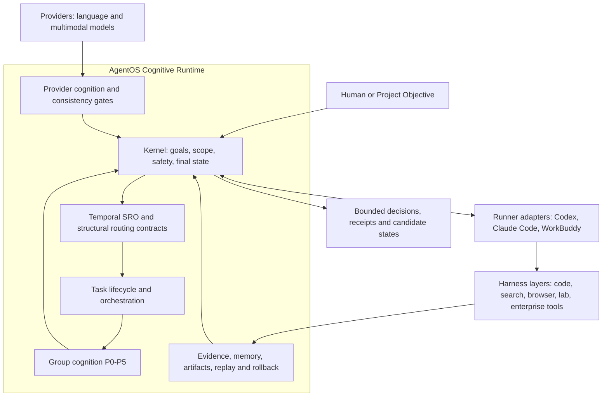

# AgentOS

**Harness 与 Runner 的认知运行时操作系统**<br>
**A cognitive runtime operating system for Harnesses and Runners**

当前版本 / Current version: **AgentOS CoreSlim 0.3.1**

[中文](#中文) | [English](#english) | [Apache-2.0](LICENSE)

## 中文

### AgentOS 是什么

AgentOS 不是 Codex、Claude Code、WorkBuddy 或某个 Harness 的插件。它位于这些可替换执行部件之上，扮演持续运行的认知与治理层：理解目标，保持约束，组织证据，处理冲突，管理候选知识，并决定什么可以继续、什么必须等待、什么需要被证伪或回滚。

Runner 负责承载交互和推进任务，Harness 负责搜索、浏览器、代码、实验、文件和外部系统等具体执行，Provider 为运行时提供语义判断能力。AgentOS 把它们组织成一个能够跨步骤、跨工具、跨项目保持认识论连续性的系统。

简单地说：**Runner 让任务跑起来，Harness 让动作发生，Provider 提供认知支持，AgentOS 让整个过程知道自己在做什么、凭什么这样做，以及结果可以被相信到什么程度。**

### 为什么需要它

当一个复杂任务跨越多个模型、窗口、工具和项目时，真正困难的通常不是再生成一段文本，而是保持以下连续性：

- 目标和范围没有在长链路中悄悄漂移；
- 搜索词、证据、模型判断和最终主张不会混为一谈；
- Provider 的语义判断受到证据、schema 和一致性门控约束；
- 暂时结果保持为 candidate，不会自动变成正式知识；
- 冲突、反例、复现失败和过期信息能够传播到下游资产；
- 每次写入都有回执、哈希、回放路径和必要的回滚指针；
- 多个认知角色的协作可以被衡量，而不只是“看起来像多智能体”。

AgentOS 的目标，就是让这些能力成为可复用的运行时基础，而不是每个项目临时拼装一次。

### 系统架构



这里的关键关系是：AgentOS 不从属于某个 Runner。Runner、Harness 和 Provider 都是可替换适配层，AgentOS Kernel 保留目标、边界、元规则、冲突处理和最终候选状态的所有权。

### Kernel 与认知组件

| 组件 | 作用 |
| --- | --- |
| Temporal SRO 与结构路由合同 | 识别约束场、隐藏约束、迁移风险和候选算子；当前提供 provider-backed 合同与边界门控 |
| Task Lifecycle | 管理任务状态、checkpoint、暂停、恢复、重试和 rollback |
| Provider Execution Plane | 路由 provider 任务，执行 schema 校验、fallback、调用回执与 provenance 记录 |
| Provider Cognition Layer | 要求语义操作具有 provider 支持，并检查 evidence/judgment consistency；冲突时 fail closed |
| Quality Decision Matrix | 分离证据准入、范围覆盖、基线资格、阅读完整性、发布与保留判断 |
| Evidence 与 Cbit 控制 | 维护证据维度；将 Cbit 作为信息增益、停止条件和群体评估信号，而不是未经验证的万能分数 |
| Artifact 与 Memory Runtime | 管理 candidate、accepted、quarantine、版本关系、信用事件和依赖失效 |
| Safety 与 Tool Bridge | 限制 capability、路径和写操作，保留哈希、回放和回滚信息 |

群体认知扩展由六个独立模块组成：

- **P0 Evaluation**：比较群体与最佳成员，测量纠错率、多样性、收敛和负迁移拦截；
- **P1 Epistemic Review**：使用对抗审查和独立复现区分 bounded support、pending 与 falsified；
- **P2 Credit Ledger**：记录经裁决的历史表现，不让声誉直接越权成为事实；
- **P3 Agent Registry**：注册不同角色、模型和隔离上下文，组建可审计团队；
- **P4 Endogenous Agenda**：从开放问题、残余竞争解释和预期信息增益中选择下一轮候选；
- **P5 Cascading Invalidation**：让被证伪或过期的知识沿依赖关系失效、隔离或停止复用。

### 怎样使用

推荐把 AgentOS 与一个成熟 Runner 配合使用：

- **Codex**：适合代码库审计、实现、测试和本地工具编排；
- **Claude Code**：适合长上下文代码与文档工作流；
- **WorkBuddy**：适合已有企业执行环境中的任务承载；
- 其他 Runner 也可以接入，只要能够交换结构化任务、回执和状态。

Runner 下方可以连接多个 Harness，例如代码执行、浏览器、搜索、数据分析、实验设备、企业应用或自定义 MCP 服务。Provider 可以使用一个或多个模型服务，并通过 adapter 接入。

建议的使用顺序：

1. 把项目目标、可写范围、禁止动作和验收门冻结为 seed；
2. 由 Runner 启动 AgentOS runtime，并注册可用 Provider 与 Harness；
3. 让 Kernel 形成任务和认知角色，Harness 只执行授权动作；
4. 将证据和 provider judgment 分别落盘，再通过一致性与认识论门控；
5. 输出 candidate、manifest、hash inventory、replay/rollback pointer 和下一轮候选；
6. 只有通过明确 promotion gate 的资产才能进入 accepted 基线。

### 快速验证

```powershell
git clone https://github.com/zhaoheng1990-debug/AgentOS.git
cd AgentOS\agentos_core_slim_v0
python -m pip install pytest
pytest -q tests
python -m compileall -q agentos_kernel tests examples
```

最小组合示例：

```python
from agentos_kernel import (
    CognitiveModuleRegistry,
    EpistemicReviewProtocol,
    GroupCognitionEvalHarness,
    ProviderBackedRuntimeCognitionLayer,
)

modules = CognitiveModuleRegistry()
modules.register(GroupCognitionEvalHarness())
modules.register(EpistemicReviewProtocol())

provider_gate = ProviderBackedRuntimeCognitionLayer()
review = modules.require_one("epistemic_review")
```

### 当前能力边界

CoreSlim 0.3.1 已通过 87 个本地测试和一次真实归档项目源的 provider-backed P0-P5 smoke test。该 smoke test 成功阻断了一个 evidence/judgment 自相矛盾的 provider receipt，并在 revalidation 后保留有界主张、证伪过度主张。

但这仍然不等于生产级群体认知：当前实测群体表现与最佳单体持平，并未证明群体优于最佳成员；不同 Provider 组织、长期运行、并发调度、跨项目信用迁移和大规模失效传播仍需要更多验证。AgentOS 当前是可运行、可审计的认知运行时基座，不是一个已经完成的通用智能系统。

## English

### What AgentOS is

AgentOS is not a plugin for Codex, Claude Code, WorkBuddy, or a particular Harness. It is the persistent cognitive and governance runtime above these replaceable execution components. It owns goals, scope, meta-rules, evidence organization, conflict handling, replay, and final candidate state.

A Runner hosts interaction and advances work. Harnesses perform concrete actions such as coding, search, browser automation, experiments, file operations, and enterprise integrations. Providers supply bounded semantic support. AgentOS keeps the whole process epistemically coherent across steps, tools, models, and projects.

**Runners keep work moving. Harnesses make actions happen. Providers support cognition. AgentOS preserves what the system is trying to do, why a decision is justified, and how far a result may be trusted.**

### Core capabilities

- Kernel-owned goals, boundaries, safety rules, and final candidate states;
- provider routing, schema validation, fallback, provenance, and invocation receipts;
- source-grounded semantic consistency gates with fail-closed revalidation;
- durable task lifecycle, checkpoints, replay, hashes, and rollback;
- evidence admission, quality decisions, artifact versions, and cognitive asset states;
- falsification-first review, independent replication, epistemic credit, endogenous agenda selection, and cascading invalidation;
- measurable group evaluation against the best individual member.

### Using AgentOS

Use AgentOS with a capable Runner such as Codex, Claude Code, or WorkBuddy. Connect the Runner to one or more execution Harnesses and register one or more Provider adapters. Freeze project goals and acceptance gates first, keep evidence separate from model judgments, and promote only artifacts that pass explicit epistemic and permission gates.

This repository currently exposes CoreSlim as Python source rather than a packaged distribution. Run it from `agentos_core_slim_v0`, execute the test suite, and integrate adapters around the kernel-facing primitives exported by `agentos_kernel`.

### Status and limits

CoreSlim 0.3.1 passes 87 local tests and a provider-backed P0-P5 smoke test over an archived project source. The test demonstrated semantic-conflict blocking and revalidation, bounded-claim preservation, overclaim falsification, and downstream invalidation.

It did **not** demonstrate that a group outperforms its best member: the measured result was parity. Production reliability, broad provider diversity, long-running concurrency, cross-project credit transfer, and large dependency graphs remain open validation areas.

## Repository layout

| Path | Purpose |
| --- | --- |
| `agentos_core_slim_v0/agentos_kernel/` | Kernel-facing runtime modules |
| `agentos_core_slim_v0/tests/` | Unit and cross-module tests |
| `agentos_core_slim_v0/examples/` | Provider-backed project-source smoke workflow |
| `agentos_core_slim_v0/GROUP_COGNITION_RUNTIME.md` | P0-P5 design and engineering boundaries |
| `CHANGELOG.md` | Release history |

## License

Licensed under the [Apache License 2.0](LICENSE). See [NOTICE](NOTICE) for attribution information.
