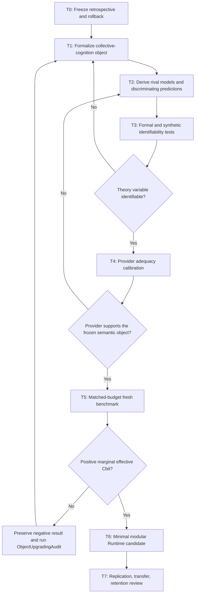

# Theory-First Research Roadmap v0.1

Status: `SUPERSEDED_BY_THEORY_RESEARCH_ROADMAP_V0_2`

The v0.1 route is retained as history. Per-round theory modeling subsequently
showed that an archived organizational identifiability audit must precede the
synthetic stage.

## Governing Rule

No engineering object is created until a theory packet identifies:

`OntologyObject -> ProjectObject -> ObservableProxy -> Metric`

and freezes a rival hypothesis, discriminating prediction, stop condition, and
Anti-Additive budget.

## Route Map

## T0: Evidence Freeze and Rollback

Status: `COMPLETE_CANDIDATE_PENDING_REVIEW`

Outputs:

- immutable v0.65-v0.89 retrospective;
- v0.65 active engineering base;
- v0.89 historical archive pointer;
- no Provider calls and no new runtime code.

Exit gate:

- rollback is non-destructive;
- every later result remains reachable by commit;
- observations are separated from module authority.

## T1: Theory Object

Status: `DRAFTED`

Primary object:

> Positive marginal effective Cbit produced by a cognitive organization beyond
> its best member.

Required review questions:

1. Is the object stated independently of AgentOS implementation?
2. Can role complementarity, error correlation, coordination friction, and
   harmful certainty be measured separately?
3. Does the theory explain both successful corrections and the v0.88-v0.89
   anti-additive failures?
4. Does it reduce, rather than rename, architectural degrees of freedom?

## T2: Rival Models

Freeze at least these models before data:

| Model | Main prediction |
| --- | --- |
| `M0_SINGLE_COMPUTE` | Matched-token single-agent iteration equals or beats organized roles. |
| `M1_COMPLEMENTARY_ROLES` | Independent evidence and error diversity create positive conditional role contribution. |
| `M2_ABSTENTION_SAFETY` | Multi-role systems reduce harm only by suppressing action. |
| `M3_COORDINATOR_CONSERVATION` | Role evidence is useful, but gain depends on a provenance-preserving coordinator. |
| `M4_OBJECT_FIRST` | Structure-space expansion improves downstream problem quality more than local answer refinement. |

Exit gate:

- each model predicts a distinct sign or failure signature;
- no metric is shared by all models without a discriminating contrast.

## T3: Formal and Synthetic Identifiability

No Provider is needed initially.

Construct a small synthetic world with:

- a hidden object containing independently observable dimensions;
- agents with controlled, partially overlapping evidence;
- controllable error correlation;
- one coordinator that preserves receipts and one that collapses them;
- explicit solution and problem-definition phases.

Preregistered tests:

1. role marginality ablation;
2. matched-total-information single-agent control;
3. matched-token control;
4. correlation sweep;
5. coordinator ablation;
6. object-first versus problem-first order;
7. early-stop versus fixed-round policy.

Stop immediately if the proposed effective-Cbit proxy cannot distinguish:

- correction from abstention;
- unique contribution from duplicate work;
- coordinator loss from role failure;
- object error from answer error.

## T4: Provider Adequacy

Only after T3 passes, test whether available Providers can reliably emit the
frozen semantic variables.

This stage tests Provider support, not organizational performance.

Required controls:

- same Provider, isolated contexts;
- different Providers, matched evidence;
- asymmetric evidence access;
- receipt replay and blinded mechanical validation;
- no candidate promotion.

Failure routes back to theory or measurement. It does not automatically add a
field to the receipt.

## T5: Fresh Matched-Budget Benchmark

The first real benchmark should compare:

- best single member;
- matched-token single-agent iteration;
- uncoordinated independent roles;
- coordinated roles;
- coordinator-only abstention control.

Primary outcomes:

- valid correction surplus;
- retained-correct rate;
- harmful strong decisions;
- calibration change;
- conditional role contribution;
- coordination loss;
- tokens and latency.

The benchmark is accepted only as evidence for the named object. It cannot
directly generate AgentOS architecture.

## T6: Minimal Engineering

Engineering begins only for theory variables with positive discriminating
evidence.

Candidate modules should remain narrow:

- `RoleEvidencePacket`
- `ConditionalContributionLedger`
- `CoordinatorCompositionReceipt`
- `MarginalCbitStopGate`

These names are placeholders, not authorized implementation tasks. Each module
must be independently removable and must not create a new monolithic runtime.

## T7: Replication and Retention

Promotion requires:

- fresh-task replication;
- at least one changed Provider or model family;
- matched-compute and matched-information controls;
- positive contribution after cost;
- no dependence on one benchmark's label convention;
- retention review under transfer, drift, and negative-transfer criteria.

## Immediate Next Action

The next action is to review and freeze a T1/T2 theory packet. No v0.90 replay,
new holdout, prompt tuning, or Provider experiment is authorized before that
review.
