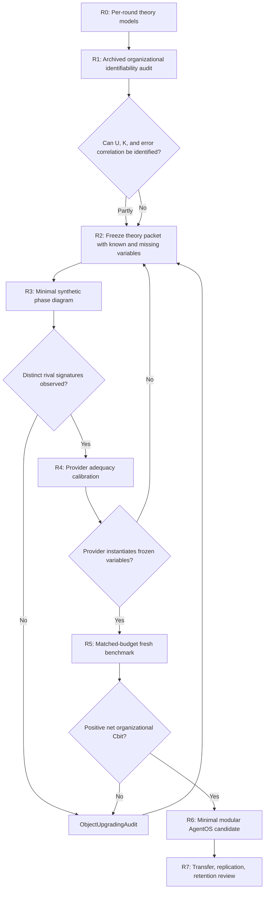

# Theory-First Research Roadmap v0.2

## Status

`REVISED_AFTER_PER_ROUND_THEORY_MODELING`

v0.1 moved the project from patch-driven engineering to theory-first research.
v0.2 adds a missing step: retrospective organizational identifiability before
formal or synthetic construction.

## Research Governance

This roadmap is governed by
`THEORY_FIRST_ENGINEERING_VALIDATION_PRINCIPLE.md`.

No engineering stage begins from a roadmap arrow alone. R3, R4, R5, or later
engineering requires an R2 theory packet with status
`FROZEN_FOR_ENGINEERING_VALIDATION` and explicit PM/HumanGate approval.

## Governing Object

```text
CognitiveOrganization
  -> unique conditional role contribution
  -> composition fidelity
  -> net effective Cbit beyond the best member
```

Representation quality remains a prerequisite, not the target claim.

## Route



## R0: Per-Round Theory Models

Status: `COMPLETE_CANDIDATE_PENDING_REVIEW`

Evidence:

- v0.64-v0.89 modeled under one card;
- theory levels separated into governance, representation, composition, and
  organization;
- local submechanism support separated from composite rejection.

Main result:

> The series contains repeated representation experiments, several
> composition failures, and no identified positive organization effect.

## R1: Archived Organizational Identifiability Audit

Status: `COMPLETE_BOUNDED`

No Provider calls. No fresh holdout. No runtime changes.

### Inputs

- immutable local output artifacts for v0.65, v0.82, v0.84, v0.88, and v0.89;
- their preregistrations, private references, runs, evaluations, and posthoc
  files;
- exact hashes preserved before analysis.

### Required outputs

1. case-aligned role/stage transition ledger;
2. unique correction and introduced-error counts;
3. retained-correct and action-suppression counts;
4. marginal token cost by stage;
5. oracle-union ceiling where computable;
6. composition loss relative to that ceiling;
7. error overlap/correlation where identifiable;
8. explicit `NOT_IDENTIFIABLE` fields;
9. theory update for `R`, `U`, `K`, correlated error, and `F`.

### Hard boundary

Retrospective analysis may describe and compare frozen outputs. It cannot:

- rescore a rejected version as accepted;
- change any preregistered gate;
- repair a receipt;
- select a threshold using revealed labels;
- authorize a Provider or Runtime experiment.

## R2: Organization Theory Packet

Status: `V0_2_FROZEN_WITH_BOUNDARY`

R1 establishes:

- one positive local representation-stage effect in v0.82;
- output complementarity without a coordinator in v0.88;
- composition loss in v0.84 and v0.89;
- safety by correct-action suppression in v0.89;
- continued non-identifiability of unique role information, best-member
  superiority, independent role errors, and coordinator synergy.

Freeze after review:

- role distinctness criteria;
- matched information, access, and cost conditions;
- conditional role contribution;
- coordinator conservation;
- correction, suppression, and harm accounting;
- stopping rule;
- rival models and discriminating predictions.

The v0.2 review candidate additionally freezes for review:

- `J^uniq` as the non-colliding symbol for conditional role information;
- task log-loss reduction as a Cbit proxy rather than ontological identity;
- the packet-only coordinator information ceiling;
- `g_t = k_t * J_t - (1 - k_t) * H_t`;
- the phase boundary `k_star = H / (J + H)`;
- cognitive equivalence and organizational surplus as separate claims;
- exact finite-system gates for R3.

The packet must state which quantities came from R1 and which remain theory
candidates.

## R3: Minimal Synthetic Phase Diagram

Status: `COMPLETE_SYNTHETIC_FORMAL_PASS`

Vary only:

- role information overlap;
- error correlation;
- coordinator fidelity;
- communication cost;
- number of rounds.

Measure the boundary:

```text
anti-additive collaboration <-> positive organizational Cbit
```

Do not add domain semantics until the boundary is identifiable in the
controlled system.

R3 result:

- 12/12 frozen gates passed;
- `J_set`, Shapley allocation, and `k_star` were recovered exactly;
- dependence reduced available packet information and raised required
  composition fidelity;
- the first nonpositive marginal round correctly marked the stopping boundary;
- positive task compression did not guarantee correct-action retention.

Theory writeback:

```text
compression-positive phase
  != action-admissible phase
```

## R4: Provider Adequacy

Status: `V0_1_FAILED_MECHANICAL_RECEIPT_VALIDITY`

Test whether local and remote Providers can instantiate:

- independent evidence-conditioned roles;
- bounded semantic packets;
- preserved disagreement;
- relation-aware correction;
- calibrated uncertainty.

Provider quality failure revises the instantiation plan, not the organization
theory automatically.

R4 v0.1 stopped at its first logical role call after two identical
probability-direction consistency failures. The result does not score Provider
calibration or coordination. It adds one protocol-level requirement:
deterministic projections of a semantic estimate belong to the Runtime and
should not be duplicated as independent Provider outputs.

R4 v0.2 is preregistered as a paired protocol diagnostic. It changes only
receipt minimality and cannot be reported as fresh validation.

R4 v0.2 completed six valid role calls, then stopped after two invalid pair
coordinator attempts. The role layer passed its frozen calibration and
stability thresholds. The coordinator returned top-level arrays and showed
prior-copying or 0.5 collapse. Post-hoc deterministic composition recovered all
pair and full subsets with mean error below 0.000073, demonstrating that the
accepted role packets contained sufficient numeric information.

The next R4 theory revision must separate:

- Provider-backed semantic relation judgment;
- Runtime-owned deterministic packet composition.

R4 v0.3 performs this object upgrade. It preserves the existing
`CognitiveCoordinationRuntime` as sole upper orchestration owner and introduces
only candidate contracts for semantic relation assessment, graph compilation,
composition plans, and deterministic receipts.

R4 v0.3A is preregistered as a zero-Provider construction test. A fresh
Provider relation experiment is not authorized until the finite object chain
passes.

R4 v0.3A passed 14/14 gates with zero Provider calls. Four actionable graphs
composed exactly. Eight unsafe, incomplete, or contradictory graphs blocked.
Naive duplicate composition produced probability overconfidence of 0.141 to
0.222. The object chain is ready for a fresh Provider semantic-relation
preregistration, but not Core synchronization.

R4 v0.3B is preregistered as a fresh same-Provider semantic relation test. It
separates batch and single-case presentation, hides relation truth and action,
and makes false combine or false deduplication hard failures.

R4 v0.3B stopped after two Batch A attempts returned `{"cases": [...]}` rather
than an accepted receipt envelope. Both unaccepted arrays classified all 12
fresh cases exactly with zero false Runtime action. The next object is a
shape-based, ambiguity-blocking receipt envelope canonicalizer validated with
zero Provider calls.

R4 v0.3C freezes `ReceiptEnvelopeIdentity` as a representation-level object.
The leading model predicts that one unique, non-empty, homogeneous
receipt-shaped collection is sufficient regardless of its key. The zero-call
test must recover both preserved responses while blocking ambiguous,
heterogeneous, empty, nested, and authority-bearing inputs.

R4 v0.3C passed all 15 frozen gates. The generic 75-line canonicalizer accepted
five admissible shapes, blocked nine unsafe or ambiguous shapes, and replayed
both preserved v0.3B responses without changing their hashes. The next
unresolved object is presentation robustness, not another envelope patch.

R4 v0.3D freezes a hybrid-time presentation diagnostic. Historical Batch A is
bound by source hash and cannot be repeated. One reversed Batch B and twelve
isolated Single calls test order and context-packing robustness while preserving
time drift as an explicit rival explanation.

R4 v0.3D passed all 15 gates. All three arms agreed 12/12 with zero harmful
Runtime action. Single isolation cost 2.447 times more tokens per receipt and
did not improve labels, while unresolved-assumption decomposition varied. The
next object is fresh hard-corpus semantic transfer, not additional repetition
on the saturated corpus.

R4 v0.3E freezes a fresh hard relation transfer test. Eighteen new cases must
be balanced across the existing six states, remove direct lexical cues, and
remain privately adjudicable. One Batch call is authorized only after corpus,
prompt, and private-reference hashes are frozen.

R4 v0.3E passed all 13 gates with 17/18 relation accuracy, 0.944 macro recall,
and zero harmful action. The only false block placed a calibrated transform of
one telemetry observation under dependent distinct rather than exact duplicate.
The next object is transformation equivalence, not a case-specific patch.

R4 v0.3F freezes five transformation-equivalence attributes and an ordered
compiler into the existing relation states. An 18-case zero-Provider grid and
six witness-removal tests must pass before any semantic attribute-inference
experiment is considered.

R4 v0.3F passed all 14 gates with 18/18 exact relation and action compilation,
six of six successful removal or perturbation tests, and byte-identical replay.
The formal grid rejects source identity and representation identity as
sufficient rules. It does not validate semantic attribute inference or
future-claim reuse safety. R4 v0.3G requires a new theory packet before any
Provider call.

R4 v0.3G freezes Provider-supported inference of the five transformation
attributes. It uses twelve fresh cases in six hidden counterfactual pairs and
one bounded batch call. Runtime alone validates evidence bindings and compiles
relations and actions. False deduplication is a hard failure.

The v0.3G corpus and implementation passed 8/8 deterministic preflight gates.
Public corpus, private reference, pair expectations, prompt, and six modules
are hash-frozen before Provider exposure. One batch call is now authorized.

R4 v0.3G closed `FAIL_SEMANTIC_WITH_ZERO_RUNTIME_ACTION_HARM`. Four attributes
and all evidence-reference sets scored 12/12. `InformationRelation` scored
8/12, exact tuples scored 8/12, and frozen gates scored 12/15. Runtime actions
remained 12/12 with zero false deduplication. The failure localizes ontology
overload in transform status versus information effect. Provider calls are
paused pending v0.3H theory-first factorization.

R4 v0.3H freezes `TransformStatus + InformationEffect` as a candidate
factorization of the overloaded `InformationRelation`. A twenty-case,
zero-Provider formal grid must resolve all four v0.3G disagreement families,
reject seventeen invalid Cartesian combinations, and preserve the existing
relation and action surface.

R4 v0.3H stopped as `FAIL_CONSTRUCTION_INVALID_GATE_IMPLEMENTATION`. The first
test run reported 65 passes, but the evaluator did not compile the seventeen
invalid Cartesian pairs and emitted the no-case-shortcut gate as a constant.
The apparent result is void. v0.3I must preserve theory and expectations while
replacing only the invalid validation instrument.

R4 v0.3I inherits the unchanged v0.3H theory, cases, removals, and thresholds.
It may correct only executable invalid-pair compilation and source-derived
shortcut audits, then freeze implementation hashes before one formal run.

The corrected v0.3I evaluator, compiler, cases, CLI, and tests are hash-frozen.
Static source audit found no case shortcut or forbidden dependency. One
zero-Provider formal execution and one replay are authorized.

R4 v0.3I passed all 16 corrected gates. Twenty cases, six removals, and all
seventeen executable invalid-pair audits passed; replay was byte-identical.
The factorization resolves all four v0.3G disagreement families without a new
relation state or action. Its causal benefit over the legacy single enum
remains untested and becomes the v0.3J object.

R4 v0.3J freezes a matched same-Provider comparison. Legacy and factorized arms
receive identical fresh evidence in two forward/reverse rounds with `L-F-F-L`
call order. The experiment separates representational ceiling, semantic
inference, Runtime action safety, revalidation resolution, and token cost.

The v0.3J twelve-case public corpus, both private references, four prompts,
call order, and implementation are hash-frozen after 71 passing preflight
tests. Both private references compile to identical immediate outcomes. Four
bounded Provider calls are authorized.

R4 v0.3J closed `FAIL_CAUSAL_BENEFIT_WITH_REVALIDATION_GAIN_AND_PRESENTATION_COST`.
Factorization improved revalidation from 10/12 to 12/12 in both rounds with
about 4.8 percent token overhead, but factorized action agreement was 9/12
versus legacy 12/12. One false combine and reverse-order tolerance-witness
omissions localize the next object as cognitive-load interference in a wide
receipt, not another ontology enum.

R4 v0.3K is HumanGate-approved and `FROZEN_FOR_ENGINEERING_VALIDATION`. It
defines a role as a bounded object view, evidence boundary, output contract,
and responsibility, not a persona label. Its causal design matches two
Provider contexts in both arms: paired wide calls are compared with isolated
provenance-state and effect-scope calls while the deterministic composer stays
fixed. Eight calls are preregistered but remain conditional on corpus and
implementation hash freeze. A Provider semantic coordinator is deliberately
excluded until role-local and composition-level failure can be separated.

The fresh sixteen-case corpus and modular experiment instrument passed 17/17
corpus gates and all 86 R4 experiment tests. Ten exact v0.3J sentence overlaps
were removed before Provider exposure, and the shared-enum boundary was
clarified without changing the model or thresholds. Corpus, references,
prompts, compiler dependencies, scorer, and tests are hash-frozen. Eight
bounded calls are authorized.

R4 v0.3K closed 13/18. Forward wide and split role bundles tied at 30/32;
reverse split fell to 25/32 versus wide 30/32. Four missing tolerance witnesses
in the reverse split effect call caused two conservative false blocks, while
semantic labels and revalidation remained strong. The formal status is
`FAIL_GLOBAL_CONTEXT_REQUIREMENT`, but the stronger mechanism evidence is
presentation-sensitive multi-witness binding, not a demonstrated need for all
roles to see global fields. Split calls used 23.92 percent fewer tokens. The
next theory object is sequential semantic-witness binding with a Runtime-derived
witness-obligation contract.

## R5: Fresh Benchmark

Required arms:

1. best single member;
2. matched-token single-agent iteration;
3. independent uncoordinated roles;
4. coordinated roles;
5. suppression-only control.

Required outcomes:

- correction surplus;
- retained-correct rate;
- harmful strong decisions;
- calibration;
- conditional contribution;
- composition loss;
- token/latency cost.

## R6: Minimal Modular Candidate

Only empirically necessary modules are eligible:

- role evidence packet;
- conditional contribution ledger;
- coordinator composition receipt;
- marginal-Cbit stopping gate.

Every module must be removable, separately testable, and candidate-only.

## R7: Transfer and Retention

Require:

- fresh-task replication;
- changed Provider or model family;
- matched-compute and matched-information controls;
- positive net contribution;
- absence of benchmark-specific dependence;
- transfer, drift, and negative-transfer review.

## Current Authorization

| Operation | Authorized |
| --- | --- |
| R1 zero-call archive audit | complete |
| R2 theory packet drafting | complete |
| R2 v0.2 HumanGate review | complete |
| R2 HumanGate freeze | approved with boundary |
| R3 finite synthetic validation | authorized |
| R3 standalone experiment code | authorized |
| R3 result | complete, synthetic-formal only |
| R4 theory and preregistration | authorized |
| R4 v0.1 Provider calls | stopped after 2/22 physical attempts |
| R4 v0.1 result | failed mechanical receipt validity; semantic gates unscorable |
| R4 claim ceiling | no adequacy conclusion |
| R4 v0.2 theory | minimal sufficient receipt frozen |
| R4 v0.2 calls | authorized within a new 11 logical / 22 physical budget |
| R4 v0.2 claim ceiling | paired protocol diagnostic only |
| R4 v0.2 result | role layer supported; coordinator experiment failed |
| next Provider calls | paused pending semantic relation theory |
| R4 v0.3 object map | frozen for standalone construction |
| R4 v0.3A | zero-Provider synthetic validation authorized |
| R4 v0.3A result | 14/14 construction pass; Provider semantics untested |
| R4 v0.3B | fresh Provider semantic relation test authorized |
| R4 v0.3B result | mechanical early stop; semantic content 12/12 twice post hoc |
| R4 v0.3C | zero-Provider envelope construction authorized |
| R4 v0.3C result | 15/15 pass; mechanical envelope anomaly closed |
| R4 v0.3D | theory and preregistration required; Provider calls paused |
| R4 v0.3D status | preregistered; 13 new logical calls authorized |
| R4 v0.3D result | 15/15 pass; exact three-arm agreement; 2.447x Single cost |
| R4 v0.3E | fresh hard relation theory required; Provider calls paused |
| R4 v0.3E status | theory and corpus construction rules frozen |
| R4 v0.3E result | 13/13 pass; 17/18 relation; transform boundary discovered |
| R4 v0.3F | transformation-equivalence theory required; Provider calls paused |
| R4 v0.3F status | 14/14 formal pass; semantic inference remains untested |
| R4 v0.3G | closed semantic fail; 12/12 Runtime actions; information relation 8/12 |
| R4 v0.3H | closed construction fail; apparent pass void |
| R4 v0.3I | 16/16 formal pass; factorization coherence supported |
| R4 v0.3J | closed 13/18 fail; revalidation gain plus wide-receipt interference |
| R4 v0.3K | closed 13/18 fail; no role gain; reverse witness-binding drift |
| v0.90 replay | no |
| new Provider calls | no |
| fresh holdout consumption | no |
| Runtime or CoreSlim changes | no |
| retention or baseline writes | no |
